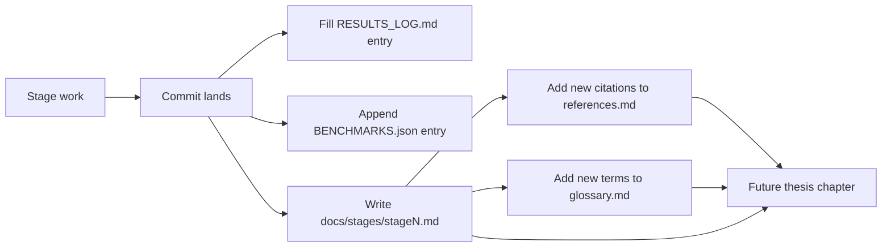

# Latos documentation

Thesis- and paper-ready notes that complement the day-to-day artifacts
in `RESULTS_LOG.md` and `BENCHMARKS.json`.

## Where to find what

| What you want | Where it lives |
|---|---|
| Chronological "what happened in each stage" + bug log | [`RESULTS_LOG.md`](../RESULTS_LOG.md) |
| Numerical metrics per stage (tests, coverage, runtimes) | [`BENCHMARKS.json`](../BENCHMARKS.json) |
| Per-stage thesis-ready writeup (methods, decisions, citations) | [`stages/`](stages/) |
| Methods + citations index | [`references.md`](references.md) |
| Materials-science + software terminology | [`glossary.md`](glossary.md) |
| Architecture diagrams | [`figures/architecture.md`](figures/architecture.md) |
| Map of stages → thesis chapters | [`THESIS_OUTLINE.md`](THESIS_OUTLINE.md) |

## How to add a new stage doc

After a stage closes (after the commit lands, before moving to the
next stage), copy [`stages/_template.md`](stages/_template.md) to
`stages/stageN_<name>.md` and fill it in while context is fresh. The
template has eight sections; expected length is 500–1000 words.

The doc is *not* a duplicate of `RESULTS_LOG.md` — that log is
chronological / bug-focused, this doc is method-focused and
thesis-shaped.

## Workflow with these docs

