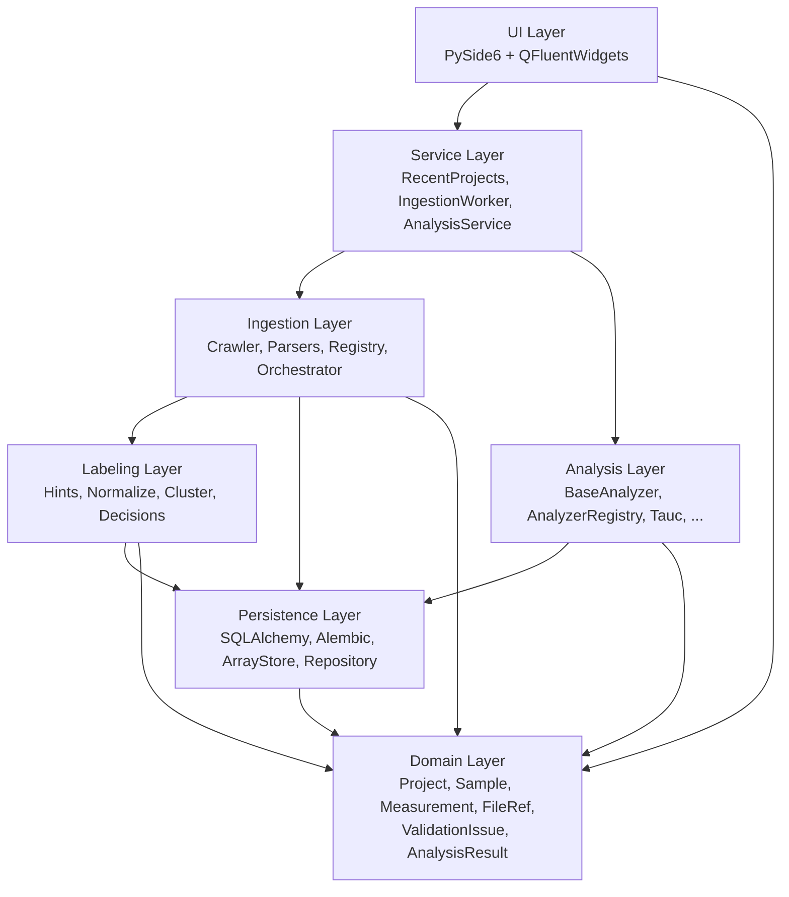
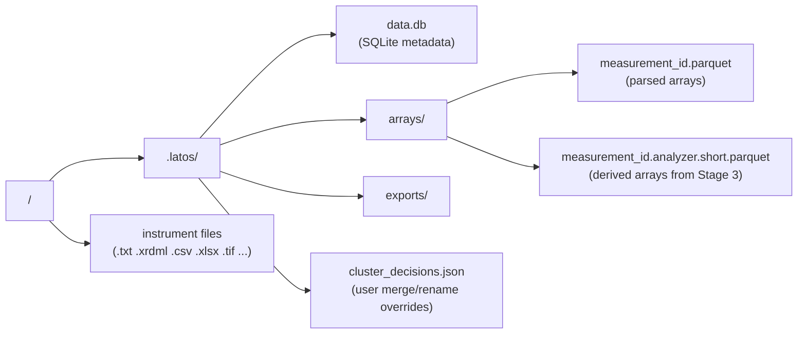
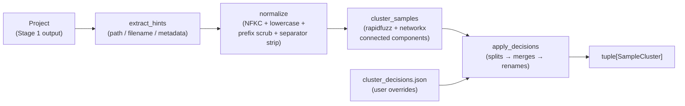
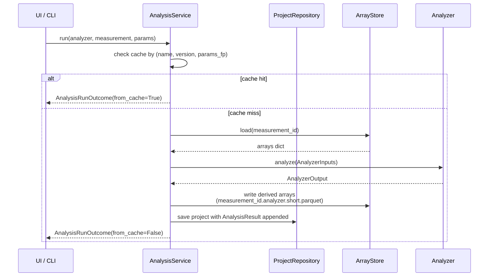
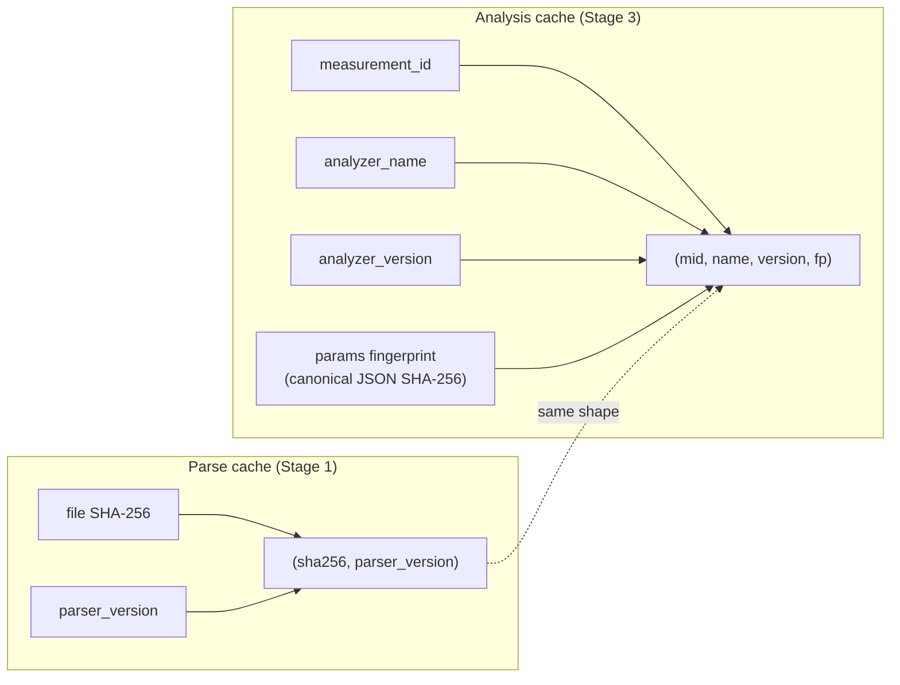

# Architecture diagrams

All diagrams are Mermaid blocks — they render in GitHub, are version-
controlled, and can be exported to PNG with the Mermaid CLI when the
thesis needs raster figures (`mmdc -i architecture.md -o out.png`).

## Layered architecture



Arrows point in the direction of *dependency*. The domain layer
depends on nothing; the UI layer depends on everything beneath it.

## On-disk project layout



## Ingestion pipeline (Stage 1)

```mermaid
sequenceDiagram
    participant UI as UI / CLI
    participant ORC as Orchestrator
    participant CRA as Crawler
    participant REG as ParserRegistry
    participant PAR as Parser
    participant AS as ArrayStore
    participant REPO as ProjectRepository

    UI->>ORC: ingest(folder)
    ORC->>CRA: walk(folder)
    CRA->>CRA: hash files (SHA-256)
    CRA->>REG: find_parser(path)
    REG-->>CRA: ParserMatch | None
    CRA-->>ORC: CrawlReport
    loop per file
        ORC->>PAR: parse_all(path)
        PAR-->>ORC: tuple[ParsedData]
        ORC->>AS: write(measurement_id, parsed)
        ORC->>REPO: save(project)
    end
    ORC-->>UI: IngestionResult
```

## Labeling pipeline (Stage 2)



## Analysis pipeline (Stage 3)



## Cache-key strategy



Both caches share the same invalidation philosophy: a version bump on
the producer (parser or analyzer) invalidates every entry it has
produced. The user never thinks about cache state.
