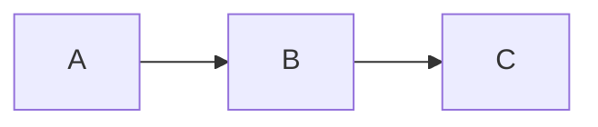

# Stage N — <Name>

<!--
  Template for per-stage thesis-ready docs. Replace the placeholders.
  Target length: 500–1000 words. Eight sections; keep them lean.
  Cross-reference RESULTS_LOG.md / BENCHMARKS.json — don't duplicate them.
-->

**Status:** ✅ complete / 🚧 in progress
**Sub-stages covered:** Na, Nb, Nc, …
**Commits:** `abc1234`, `def5678`
**Date range:** YYYY-MM-DD – YYYY-MM-DD

## 1. Goal

One or two sentences: what does this stage deliver to the user / the system?

## 2. Motivation

What was broken / impossible before this stage? Why was *this* the right
problem to solve next?

A good "motivation" section names a concrete failure mode that the
previous architecture caused, with one paragraph of context.

## 3. Design decisions

Bullet list. For each: **what was chosen**, **what alternatives were
considered**, **why this won**. Reviewers ask about alternatives — capture
them now.

- **Decision:** …
  - Alternatives considered: …
  - Why this won: …
- **Decision:** …
  - …

## 4. Methods / algorithms

The scientific or engineering methods used in this stage, with
citations. Aim for one paragraph per method, written so a reader can
map it to the textbook reference without reading the source code.

- **<Method name>**: brief description. [\[Citation key\]](../references.md#<key>)
- **<Method name>**: brief description. [\[Citation key\]](../references.md#<key>)

Include math when it sharpens the description (LaTeX in markdown
renders on GitHub):

```math
F(R) = \frac{(1 - R)^2}{2R}
```

## 5. Implementation summary

Map of the new code — files and the types they introduce. Not a code
dump; just a navigation index.

| File | What it owns |
|---|---|
| `src/latos/<…>.py` | … |

Key invariants enforced (1–3 bullets):

- …

## 6. Validation

How do we know this works? Pull numbers from `BENCHMARKS.json` and
`RESULTS_LOG.md`.

- **Tests:** N new (M total)
- **Coverage:** X%
- **Real-data behaviour:** one-line summary
- **Numerical accuracy:** (if relevant)

Mermaid diagram if helpful (data flow, lifecycle, sequence):



## 7. Limitations

What's intentionally deferred to a later stage, and what known weaknesses
are we accepting?

- …
- …

## 8. Thesis mapping

| Thesis section | What this stage feeds |
|---|---|
| Chapter X — <title> | … |

## See also

- [`RESULTS_LOG.md`](../../RESULTS_LOG.md) — chronological detail + bug log for this stage
- [`BENCHMARKS.json`](../../BENCHMARKS.json) — structured metrics
- [`references.md`](../references.md) — citations
- [`glossary.md`](../glossary.md) — terminology
