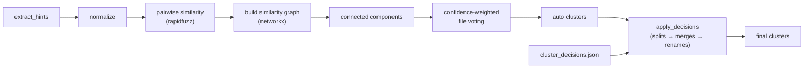

# Stage 2 — Sample identity resolution

**Status:** ✅ complete
**Sub-stages covered:** 2A (hints), 2B (normalize), 2C (cluster), 2D (decisions + UI)
**Date range:** 2026-05-08 – 2026-05-11

## 1. Goal

Replace Stage 1's per-folder sample-name heuristic with a real
identity-resolution pipeline that recognizes when "CS Pure" (in the
XRD folder) and "CS (Pure)" (in the XPS folder) refer to the same
physical sample, while keeping the human in the loop for the
inevitable edge cases.

## 2. Motivation

Stage 1 produces a `Sample` per unique parent-folder name. On the
real Dhivya dataset, this gives 12 samples. Two of them are the same
physical specimen separated by a typographic accident:

- `CS Pure` (1 XRD file, from `XRD/CS Pure/scan.txt`)
- `CS (Pure)` (4 XPS files, from `XPS/CS (Pure)/*.csv`)

This is not an exotic edge case. Researchers freely mix `CS-3`, `CS3`,
`Cs 3d`, `CS Pure`, and `cs-pure` across instruments and runs. Every
downstream analysis (per-sample plotting, ML feature aggregation,
optimization loops) breaks silently when the same physical sample
shows up under multiple identities.

Stage 2's job is to detect those near-duplicates automatically, let
the user confirm or override the clustering, and persist the decisions
so they survive re-ingestion.

## 3. Design decisions

- **Decision:** Run clustering as a post-process on the persisted
  `Project`, not inside the orchestrator.
  - Alternatives considered: Fold clustering into Stage 1's
    parse/persist loop.
  - Why this won: Decouples the parse cache from the clustering cache.
    The user can re-cluster with a different threshold without
    re-parsing 161 files. The orchestrator stays a simple pipeline.

- **Decision:** User decisions live in `cluster_decisions.json`, not
  the database.
  - Alternatives considered: Add a `cluster_decisions` table.
  - Why this won: JSON is portable (share a project folder, the
    decisions come along), inspectable in a text editor, and keyed on
    *auto* canonicals (Stage 2C's output) rather than database row
    IDs — so the file survives `Orchestrator.ingest()` re-runs that
    might assign different IDs to the same logical sample.

- **Decision:** Apply order is **splits → merges → renames**.
  - Alternatives considered: Any other order.
  - Why this won: Splits create new cluster identities; those new
    identities then participate in subsequent merge decisions; renames
    apply last so they target the surviving merged canonical.
    Reordering breaks idempotency (running apply twice would change
    the result).

- **Decision:** Combine three similarity metrics via `max`:
  Levenshtein-ratio + token-sort-ratio + Jaro-Winkler.
  - Alternatives considered: Use any single metric.
  - Why this won: Each metric catches a different class of variation.
    Levenshtein catches typos. Token-sort catches word reordering
    (`CS Pure` vs `Pure CS`). Jaro-Winkler weights matching prefixes
    (great for `CS-3` vs `CS3`). `max` is permissive — two strings are
    "similar" if *any* metric thinks so. [\[winkler1990\]](../references.md#winkler1990) [\[levenshtein1966\]](../references.md#levenshtein1966)

- **Decision:** File voting with confidence-weighted hint accumulation.
  - Alternatives considered: One-hint-per-file majority vote.
  - Why this won: Each file produces *several* hints (filename stem,
    parent folder, grandparent folder, parser metadata when available);
    each hint has a confidence in [0, 1]. Files vote into connected
    components by *summed* confidence, so a strong-but-rare metadata
    hint can outvote multiple weak-but-frequent path hints.

- **Decision:** Drop empty-file clusters from the output.
  - Alternatives considered: Keep every connected component.
  - Why this won: Generic path segments ("XRD", "XPS") appear in many
    hint extractor outputs but rarely become any file's strongest
    signal. Without the filter they showed up as phantom clusters
    containing zero files in the Dhivya regression tests.

- **Decision:** Hint weight for the immediate non-generic parent
  folder = 0.80 (above filename's 0.70).
  - Alternatives considered: Folder 0.60 (initial value).
  - Why this won: A researcher's *deliberate* folder structure should
    outrank a filename hint. With folder=0.60 and filename=0.70, the
    `XPS/CS-1/run.csv` file would cluster on the filename stem `run`
    instead of on `CS-1`. Bumping to 0.80 fixed the regression
    `test_distinct_samples_stay_separate`.

- **Decision:** Cluster review UI is a `TableWidget` with inline-
  editable canonical cells + multi-select Merge button.
  - Alternatives considered: One-page-per-cluster modal flow.
  - Why this won: Spreadsheet-style editing maps onto the user's
    mental model. ExtendedSelection + DoubleClicked-only edit triggers
    were needed to avoid the bug where single-click on the editable
    cell put the row into edit mode instead of selecting it.

## 4. Methods / algorithms

The pipeline is `extract_hints → normalize → cluster_samples →
apply_decisions` — four pure functions, each independently testable.

- **Hint extraction.** For each `FileRef`, produce a `SampleHints`
  carrying:
  - `metadata_hints` (Stage 2A reserves these for future parser-
    metadata sources; currently unused at high confidence)
  - `path_hints` — immediate parent folder (0.80 if non-generic, 0.20
    if generic), then deeper ancestors with weights `(0.80, 0.50,
    0.40, 0.30)`
  - `filename_hint` — the file stem after a cleaning regex strips
    technique tags, dates, "run", "scan", trailing digits when alone
    (weight 0.70)

- **Normalization.** Idempotent string canonicalization. NFKC Unicode
  normalization → lowercase → strip leading throwaway prefixes
  ("run", "sample", "test") → collapse separators (`-_.\s`) → final
  NFKC pass to handle locale quirks (Turkish dotted-İ).

  ```math
  normalize(normalize(s)) = normalize(s) \quad \forall s
  ```

  This invariant is enforced by a hypothesis property test.

- **Similarity scoring.** For two normalized names `a` and `b`:

  ```math
  sim(a, b) = \max(
    \text{Lev-ratio}(a, b),
    \text{token-sort-ratio}(a, b),
    \text{Jaro-Winkler}(a, b)
  )
  ```

  All three are bounded in [0, 1]. Above the threshold (default 0.85),
  the pair is connected in the similarity graph.

- **Connected-component clustering.** Build an undirected graph
  G = (V, E) where V = unique normalized hints and E = pairs above
  threshold. Use `networkx.connected_components(G)`. Each component
  becomes a `SampleCluster` with one canonical name (chosen by total
  file-vote weight, with deterministic tiebreaks) and a tuple of
  aliases. [\[hagberg2008\]](../references.md#hagberg2008)

- **Decision application.** A `ClusterDecisions` carries three
  override types:
  - **splits** — `dict[path_str, target_canonical]`, pulling a file
    out of its auto-assigned cluster into a named target
  - **merges** — `list[tuple[canonical, ...]]`, collapsing N existing
    clusters into one
  - **renames** — `dict[old_canonical, new_canonical]`, just relabel

  Apply order is splits → merges → renames. The result is persisted
  atomically to `cluster_decisions.json` via the same `.tmp +
  os.replace` pattern Stage 1's `ArrayStore` uses.

## 5. Implementation summary

| File | What it owns |
|---|---|
| `src/latos/ingestion/labeling/hints.py` | `SampleHints` + `extract_hints(path, parsed_data?, root?)` |
| `src/latos/ingestion/labeling/normalize.py` | `normalize(s)`, `tokens(s)`, NFKC + lowercase + scrub pipeline |
| `src/latos/ingestion/labeling/cluster.py` | `cluster_samples(hints, threshold=0.85)`, `SampleCluster` |
| `src/latos/ingestion/labeling/decisions.py` | `ClusterDecisions` + `apply_decisions`, atomic JSON I/O |
| `src/latos/ingestion/labeling/pipeline.py` | `cluster_project(project)` — public entry point |
| `src/latos/ui/pages/cluster_review.py` | Editable `TableWidget` page wired into the sidebar |

Key invariants enforced:

- `normalize` is idempotent and order-independent under hypothesis property tests.
- Apply is order-deterministic (splits → merges → renames).
- Empty-file clusters are dropped before output.
- Split keys use `str(Path(...))` so they round-trip cross-platform.

## 6. Validation

- **Tests:** 181 new in Stage 2 (746 total at end of stage).
- **Coverage:** 100% on `hints`, `normalize`, `decisions`, `pipeline`;
  93% on `cluster`; 96% on the cluster review UI page.
- **Real-data behaviour (Dhivya, 161 files):**
  - Stage 1 produced 12 samples → Stage 2 collapses to 11 clusters.
  - `CS Pure` and `CS (Pure)` correctly merged (the headline regression).
  - Cluster phase: 42 ms (negligible vs the 2.6 s ingest).
- **Quality gates:** ruff + mypy strict clean.



## 7. Limitations

- **Short prefix-similar names chain together.** `CS-1`, `CS-3`, `CS-5`
  are sufficiently Jaro-Winkler-similar that they form one connected
  component with `CS`, producing an over-merge. The cluster review UI
  is the user's escape hatch (revert or split via the page). A
  chemistry-aware similarity booster (recognizing that `Cs1Bi2I9` and
  `Cs3Bi2I9` differ in stoichiometry, not in spelling) is on the
  roadmap.

- **Threshold is global, not per-project.** Default 0.85 works for the
  Dhivya dataset; some projects with very-similar sample names might
  want a stricter 0.95. The threshold is wired through the pipeline
  function — a future UI knob would let the user adjust without code
  changes.

- **No cross-modal merging from parser metadata.** A parser that
  extracts a sample-ID from the file's metadata would feed
  `metadata_hints` at 0.85–1.00 confidence, which could collapse
  variants the path-hint layer can't see. None of the current Stage 1
  parsers expose such metadata; this lights up when a future parser
  does.

## 8. Thesis mapping

| Thesis section | What this stage feeds |
|---|---|
| 4.1 Problem: sample-identity drift | Motivation; the `CS Pure` vs `CS (Pure)` example as a concrete case |
| 4.2 Hint extraction | Hint sources + weight rationale; the path-depth decay schedule |
| 4.3 Normalization | NFKC + idempotency proof sketch; hypothesis property test |
| 4.4 Similarity metric design | The three-metric `max` combination; why each catches a different variation class |
| 4.5 Graph clustering | Connected components on the similarity graph; vote-weighted canonical picking |
| 4.6 Human-in-the-loop overrides | `ClusterDecisions`, JSON persistence, apply-order rationale |
| 4.7 Results | 12 → 11 collapse on Dhivya; 42 ms runtime; known over-merge case |

## See also

- [`RESULTS_LOG.md`](../../RESULTS_LOG.md) — chronological entry for 2A through 2D + the headline regression case
- [`BENCHMARKS.json`](../../BENCHMARKS.json) — Stage 2 entry with the per-substage metrics
- [`figures/architecture.md`](../figures/architecture.md) — labeling pipeline diagram
- [`references.md`](../references.md) — `levenshtein1966`, `winkler1990`, `rapidfuzz`, `hagberg2008`
