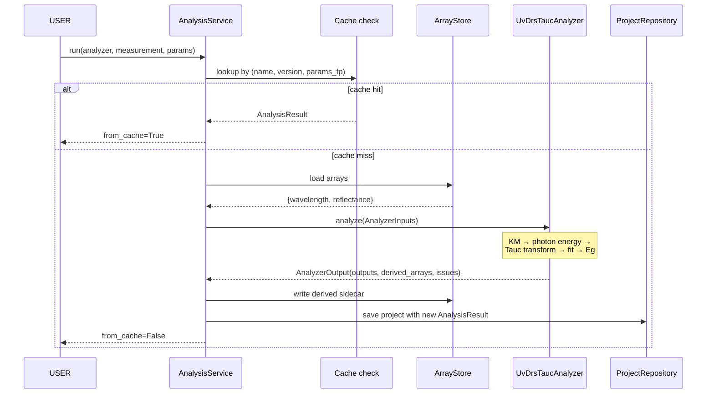

# Stage 3 — Derived analysis framework

**Status:** ✅ complete (3A + 3B + 3C + 3D)
**Sub-stages covered:** 3A (`AnalysisResult` domain + persistence), 3B (analyzer protocol + UV-DRS Tauc), 3C (Analysis UI page), 3D (XRD peak-fit analyzer)
**Date range:** 2026-05-13 – 2026-05-18

## 1. Goal

Turn parsed measurements into derived scientific quantities (band gap,
peak positions, transport figures of merit, ...) through a uniform
analyzer framework that mirrors the Stage 1 parser framework, with
results that persist alongside the parent measurement and re-appear on
project re-open.

## 2. Motivation

A `Measurement` carries raw arrays (wavelength + reflectance for
UV-DRS, 2θ + intensity for XRD, ...). The headline numbers a
researcher *actually wants* — band gap in eV, peak centers in 2θ,
zT at 300 K — require additional computation: a Tauc plot, a peak fit,
a Seebeck-σ-κ combination.

Without a dedicated analysis layer, every UI feature ("show me band
gap vs composition", "plot zT vs temperature for the X sample family")
would either re-compute on every open (slow), bake the analysis into
the parser (couples concerns), or scatter ad-hoc scripts across the
codebase (impossible to test or version).

Stage 3 establishes the analyzer-as-first-class-citizen pattern so
every future derived quantity follows the same machinery: a typed
input contract, a typed output contract, a registry, a service with
caching, and persistent storage of results.

## 3. Design decisions

- **Decision (3A):** `AnalysisResult` is an *immutable child* of
  `Measurement`, not a sibling.
  - Alternatives considered: Top-level `analysis_results` table
    referencing measurements; per-analyzer result tables.
  - Why this won: An analysis result without its parent measurement is
    meaningless. Cascade-delete handles cleanup; the existing
    repository's eager-load (`lazy="selectin"`) handles loading.
    `Measurement.analysis_results: tuple[AnalysisResult, ...]` mirrors
    `.files` and `.issues` exactly.

- **Decision (3A):** `params` and `outputs` are JSON columns.
  - Alternatives considered: Per-analyzer typed columns; per-analyzer
    subtables.
  - Why this won: Analyzer outputs are heterogeneous by definition
    (the Tauc analyzer produces `band_gap_ev` + `r_squared`; an XRD
    peak-fit analyzer produces `peak_centers_2theta` as a list +
    `fwhm_2theta` as a list). A typed-column schema would balloon as
    analyzers are added. JSON is the right shape; the producer
    guarantees JSON-safety.

- **Decision (3A):** Analyzer issues are inlined into a single
  `issues_json` column, not a separate `analysis_issues` table.
  - Alternatives considered: Sibling table mirroring
    `validation_issues`.
  - Why this won: Analyzer issues are typically 0–3 entries per
    result; the join cost dwarfs the data. Inlining keeps the read
    path simple.

- **Decision (3B):** `BaseAnalyzer.analyze()` never raises.
  - Alternatives considered: Exceptions for bad inputs.
  - Why this won: Same contract as `BaseParser.parse()`. A bad input
    (missing arrays, NaN data, fit non-convergence) surfaces as a
    `ValidationIssue` on the `AnalyzerOutput`. The UI shows the issue
    to the user; the cache key still records the attempt so repeated
    runs don't keep failing the same way.

- **Decision (3B):** Cache key includes `params_fingerprint`.
  - Alternatives considered: Cache on `(measurement_id,
    analyzer_name, analyzer_version)` only.
  - Why this won: An analyzer with different params (e.g. Tauc with
    `band_gap_type="direct"` vs `"indirect"`) is a *different
    analysis*, not a cache hit. Canonical JSON + SHA-256 → stable
    16-char hex fingerprint that's identical for semantically-equal
    dicts regardless of key order.

- **Decision (3B):** Re-running with same key *replaces* the prior
  result rather than appending.
  - Alternatives considered: Append every run; never delete.
  - Why this won: A measurement should not accumulate an unbounded
    list of `AnalysisResult`s with identical params just because the
    user clicked "Re-run" three times. The displaced result is gone;
    if the user wanted history, they'd have changed a parameter (and
    thus the fingerprint).

- **Decision (3B):** Derived arrays land in a sidecar Parquet file
  `<mid>.<analyzer_name>.<short_id>.parquet`, alongside the parsed
  arrays but with a compound filename.
  - Alternatives considered: One big Parquet per measurement with
    everything; per-analyzer subdirectory.
  - Why this won: Same `arrays/` directory keeps backup/sync rules
    simple. Compound filename makes provenance visible at the file-
    system level. Atomic `.tmp + os.replace` write reuses the
    `ArrayStore` pattern.

- **Decision (3B):** First analyzer is **UV-DRS Tauc**, not XRD
  peak-fit.
  - Alternatives considered: XRD peak-fit (more data in the
    dataset).
  - Why this won: Tauc is one well-defined computation with one
    headline scalar output (`band_gap_ev`). Peak-fit is a
    constrained-optimization problem with N variable-shape outputs.
    Tauc lets the protocol mature against a clean reference before
    being stressed by a harder case (XRD peak-fit becomes Stage 3D).

- **Decision (3C):** AnalysisPage tree shows only measurements with
  at least one applicable analyzer.
  - Alternatives considered: Show every measurement, grey out
    non-analyzable ones; show a separate "no analyzer" section.
  - Why this won: A measurement with no applicable analyzer has
    nothing the user can do on this page. The user can cross-
    reference SampleReviewPage for the full measurement list.
    Hiding keeps the tree visually clean and the user's choices
    actionable.

- **Decision (3C):** Parameter form is auto-generated by type
  dispatch on `analyzer.default_params`.
  - Alternatives considered: A per-analyzer hand-written form; a
    JSON-schema-driven form with per-parameter metadata.
  - Why this won: Zero-config form generation works for every
    analyzer with no extra plumbing. Bool → CheckBox, int → SpinBox,
    float → DoubleSpinBox, str → LineEdit. A future
    `param_metadata` class attribute on `BaseAnalyzer` can extend
    this with units, ranges, and choices without breaking existing
    analyzers — purely additive.

- **Decision (3C):** `AnalysisPage` doesn't construct its own
  service/registry/array-store — they're injected via `bind_runtime()`.
  - Alternatives considered: The page builds its own runtime from
    the current project root.
  - Why this won: Decouples page construction from project state.
    The page exists in the sidebar before any project is opened;
    runtime binding happens once per project open. Tests inject
    stubs through the same interface the main window uses.

- **Decision (3C):** Re-run uses `force=True` and replaces the prior
  same-key result rather than appending.
  - Alternatives considered: Append every Re-run; never delete.
  - Why this won: Carries the Stage 3B service contract into the UI
    without surprise. Users expect "Re-run" to update the result,
    not pile up duplicates. If they want history, changing a
    parameter changes the cache key.

- **Decision (3C):** Tauc-specific plot overlays (`fit_line` array +
  vertical line at `band_gap_ev`) live in `AnalysisPage._render_result_plot`,
  not in a Tauc-only widget.
  - Alternatives considered: A `TaucResultWidget` swapped in when
    the analyzer is `uvdrs-tauc`.
  - Why this won: Pattern-based ("if a `fit_line` array is present,
    overlay it"; "if a `band_gap_ev` scalar is in outputs, draw a
    vertical line at it"), so any future analyzer that emits the
    same conventional names automatically gets the same
    visualization. Per-analyzer custom widgets stay an option if a
    truly bespoke render is needed later.

- **Decision (3D):** Baseline by SNIP [\[ryan1988\]](../references.md#ryan1988)
  rather than a polynomial / rolling-ball / asymmetric-least-squares fit.
  - Alternatives considered: polynomial fit (rejected — chooses
    degree per-spectrum, biases peak tails); rolling ball (rejected —
    sensitive to ball radius vs. peak width interaction);
    `pybaselines.whittaker.asls` (good but adds a second hyperparameter
    `p` whose role is non-intuitive for end users).
  - Why this won: SNIP is the literature consensus for XRD/XRF — one
    hyperparameter (max half-window in 2θ degrees), insensitive to
    peak count, and the optimizer used by GSAS-II, Bruker EVA, and
    `xrdfit` [\[daniels2020\]](../references.md#daniels2020).

- **Decision (3D):** Detection prominence threshold is
  `max(3·σ_MAD, 0.01·max(corrected))`, not a single fixed value.
  - Alternatives considered: fixed fraction-of-max only; fixed
    absolute counts; second-derivative detection.
  - Why this won: 3σ_MAD adapts to per-spectrum noise (MAD is robust
    to peaks themselves), and the 1%-of-max floor catches the case
    where the noise estimate collapses (extremely clean spectra
    where `MAD ≈ 0`). Together they keep false-positive rate at the
    Gaussian-3σ level (~0.3%) without missing weak real peaks.
    Second-derivative detection is more sensitive to shoulders but
    needs more aggressive smoothing and produces worse results on
    noisy lab-scale data — deferred to a future version.

- **Decision (3D):** Profile is pseudo-Voigt with a *single shared σ*
  per peak (lmfit's `PseudoVoigtModel`), not Voigt or
  Thompson-Cox-Hastings (separate σ_G, γ_L).
  - Alternatives considered: True Voigt (convolution of Gaussian and
    Lorentzian, two width parameters); TCH pseudo-Voigt.
  - Why this won: A single σ + η captures both instrumental (Gaussian)
    and finite-size (Lorentzian) contributions in one analytical form
    and is what every XRD package reaches for first
    [\[thompson1987\]](../references.md#thompson1987). True Voigt and
    TCH need an instrument-broadening calibration scan to be
    meaningful — a Stage 4 cross-modal task.

- **Decision (3D):** Peaks whose ±2·FWHM windows overlap are fit as
  a single composite model, not independently.
  - Alternatives considered: Always fit one peak at a time on a
    local window; always fit all peaks globally.
  - Why this won: Per-cluster composite fitting is what handles
    Kα₁/Kα₂ splits and overlapping reflections from solid solutions
    without the weaker peak being absorbed into the stronger peak's
    tail. A *global* fit would couple every peak in a scan to every
    other peak — wasted parameters and worse convergence for
    well-separated peaks.

- **Decision (3D):** Empirically measure FWHM on a fine grid rather
  than trusting lmfit's derived `fwhm` parameter.
  - Alternatives considered: Use `result.params['fwhm']` from lmfit.
  - Why this won: lmfit's `fwhm` derived parameter for
    `PseudoVoigtModel` reports `2·σ` *regardless of η* — an internal
    convention that only matches the actual curve FWHM for pure
    Lorentzian (η=1). For mixed pseudo-Voigt, evaluating the model
    on a 5001-point grid within ±5σ and measuring half-max crossings
    gives the true FWHM. Verified against the synthetic-spectrum
    closed form to within 2% on pure Lorentzian peaks.

- **Decision (3D):** Per-peak `sigma` is constrained to
  `[step, 3·σ_init]` during the composite fit.
  - Alternatives considered: Unbounded `sigma`; tighter `[0.5σ_init,
    2σ_init]` window.
  - Why this won: Asymmetric doublets (e.g. 2:1 amplitude ratio,
    Kα₁/Kα₂-like) without the upper bound let the weaker peak's
    width balloon to absorb the tail of the stronger peak, dragging
    its center 0.1–0.5° away from truth. 3× is loose enough to
    accommodate genuine broadening (deformed crystallites, mixed
    phases) and tight enough to break the absorption pathology. The
    lower bound prevents the fit collapsing to a single sample
    width.

## 4. Methods / algorithms

### 4.1 Cache key (Stage 3B)

```math
\text{key} = (\text{measurement\_id},\ \text{analyzer\_name},\ \text{analyzer\_version},\ \text{fp}(\text{params}))
```

with

```math
\text{fp}(p) = \text{SHA-256}(\text{json.dumps}(p,\ \text{sort\_keys}=\text{True}))[:16]
```

Bumping the analyzer's version invalidates every cached entry that
analyzer ever produced — the same hash-and-version pattern Stage 1
uses for parsers.

### 4.2 Kubelka-Munk transform (Tauc, Stage 3B)

UV-DRS measures diffuse reflectance R ∈ [0, 1]. The Kubelka-Munk
function

```math
F(R) = \frac{(1 - R)^2}{2R}
```

is proportional to the absorption coefficient α of a thick, weakly-
absorbing scatterer (the standard powder/film geometry). [\[kubelka1931\]](../references.md#kubelka1931)

### 4.3 Photon energy conversion

```math
E\ [\text{eV}] = \frac{1240}{\lambda\ [\text{nm}]}
```

The constant is `hc/e` rounded to 4 significant figures (0.066% error,
the community standard).

### 4.4 Tauc plot

For a semiconductor with a band gap Eg, the absorption coefficient
above the gap obeys

```math
\alpha(E) \propto (E - E_g)^{1/n}
```

where n = 2 for a direct allowed transition and n = 1/2 for an
indirect allowed transition. The Tauc plot then plots

```math
y(E) = \big(F(R) \cdot E\big)^n
```

against E. The linear region of the rising edge, extrapolated to the
x-axis, gives Eg as the x-intercept. [\[tauc1966\]](../references.md#tauc1966) [\[davis1970\]](../references.md#davis1970)

### 4.5 Linear-fit window selection

Stage 3B's analyzer picks the fit window by *y-percentile* rather than
by hard-coded energy bounds: keep data points whose Tauc-y value lies
between `fit_window_y_min_frac × max(y)` and `fit_window_y_max_frac ×
max(y)`. Defaults are 0.20 and 0.60 — the rising-edge middle band.
This is robust to spectra with different absolute Tauc-y scales (band
gap energies of 1.7 eV vs 3.1 eV) without requiring per-sample tuning.

The linear fit itself is ordinary least squares (`np.polyfit(deg=1)`).
Goodness-of-fit is reported as R² on the fit window; the analyzer
emits a `Severity.WARNING` issue if R² < 0.95.

### 4.6 Output validation

`AnalysisService._validate_output()` enforces that an analyzer
returned:

- A dict for `outputs` (will round-trip through a JSON column)
- 1-D ndarrays of equal length for `derived_arrays` (same contract as
  `ParsedData.arrays`)
- A tuple of `ValidationIssue` for `issues`

A buggy analyzer returning the wrong shape raises `AnalysisError` at
the service layer (an actual exception, not a soft issue) — bugs in
analyzer code should fail loudly.

### 4.7 SNIP baseline (XRD peak-fit, Stage 3D)

The Statistics-sensitive Non-linear Iterative Peak-clipping algorithm
[\[ryan1988\]](../references.md#ryan1988) iteratively shrinks each point
toward the average of its neighbours at growing window widths:

```math
y_i^{(w+1)} = \min\!\Big(y_i^{(w)},\ \tfrac{1}{2}\big(y_{i-w}^{(w)} + y_{i+w}^{(w)}\big)\Big)
```

for `w = 1, 2, …, w_max`. The single hyperparameter `w_max` (half-window
in samples — converted from a user-friendly 5° default by dividing by
the scan step) controls how aggressively wide features get flattened
into baseline. Real peaks survive because they're narrower than `w_max`;
slowly-varying amorphous backgrounds get pressed into the baseline.

### 4.8 Adaptive prominence threshold (Stage 3D)

```math
\text{prominence threshold} = \max\!\big(3\,\sigma_{\text{MAD}},\ 0.01 \cdot \max(\text{corrected})\big)
```

where σ_MAD is a robust noise estimate from the first differences of
the corrected curve:

```math
\sigma_{\text{MAD}} = 1.4826 \cdot \frac{\text{median}(|\Delta y - \text{median}(\Delta y)|)}{\sqrt{2}}
```

The factor √2 corrects for the noise-doubling from differencing. The
1.4826 consistency constant maps MAD to a Gaussian σ
[Rousseeuw & Croux 1993]. Computing the noise from *differences*
(rather than residuals against a smooth) keeps the estimate robust
when peaks themselves dominate the spectrum.

### 4.9 Composite pseudo-Voigt fit (Stage 3D)

For peaks whose ±`fit_window_fwhm_multiplier`·FWHM windows overlap, the
fit is run as an lmfit `CompositeModel` of `PseudoVoigtModel`s sharing
a common 2θ window:

```math
y_{\text{model}}(x) = \sum_{k=1}^{N_{\text{cluster}}} A_k\,\big[(1-\eta_k)\,G(x;\,\mu_k,\,\sigma_k) + \eta_k\,L(x;\,\mu_k,\,\sigma_k)\big]
```

Initial guesses come from `scipy.signal.peak_widths` at the half-prominence
level; each `sigma_k` is bounded to `[step, 3·σ_init]` and each `η_k` to
`[0, 1]`. The Levenberg-Marquardt optimizer (lmfit default) then refines
all `4·N_cluster` parameters jointly.

### 4.10 Empirical FWHM measurement (Stage 3D)

After the fit converges, the analyzer evaluates each peak's model on a
5001-point grid spanning ±5σ around the center, locates the
half-max crossings on both sides, and reports the FWHM as the
crossing-to-crossing distance:

```math
\text{FWHM}_{\text{empirical}} = x_{\text{high crossing}} - x_{\text{low crossing}}
```

This bypasses lmfit's `fwhm` derived parameter which reports `2σ` (the
Lorentzian limit) regardless of mixing fraction.

### 4.11 Goodness-of-fit metrics (Stage 3D)

For the global fit on the baseline-corrected curve:

```math
R^2 = 1 - \frac{\sum_i (y_i^{\text{obs}} - y_i^{\text{model}})^2}{\sum_i (y_i^{\text{obs}} - \bar{y}^{\text{obs}})^2}
\qquad
\chi^2_\nu = \frac{\sum_i (y_i^{\text{obs}} - y_i^{\text{model}})^2}{(N - 4\,N_{\text{peaks}}) \cdot \sigma_{\text{noise}}^2}
```

R² < 0.8 attaches a `Severity.WARNING` issue (model is missing a peak,
miscalibrated baseline, or wrong line shape).

## 5. Implementation summary

| File | What it owns |
|---|---|
| `src/latos/core/models.py` | `AnalysisResult` dataclass + `Measurement.analysis_results` field |
| `src/latos/persistence/schema.py` | `AnalysisResultRow` ORM table + `LATEST_SCHEMA_VERSION=3` |
| `src/latos/persistence/mappers.py` | `analysis_result_to_row` / `row_to_analysis_result` + `ValidationIssue ↔ JSON` helpers |
| `src/latos/persistence/repository.py` | Save / load extended with `analysis_results` |
| `migrations/versions/0003_add_analysis_results.py` | Alembic migration for the new table |
| `src/latos/analysis/base_analyzer.py` | `BaseAnalyzer` ABC, `AnalyzerInputs`, `AnalyzerOutput` |
| `src/latos/analysis/registry.py` | `AnalyzerRegistry.find_for(measurement)` |
| `src/latos/analysis/service.py` | `AnalysisService.run(...)` — cache, persist, write derived Parquet |
| `src/latos/analysis/uv_drs/tauc.py` | `UvDrsTaucAnalyzer` — Kubelka-Munk + Tauc-plot band gap |
| `src/latos/analysis/xrd/peak_fit.py` | `XrdPeakFitAnalyzer` — SNIP baseline + Savgol smoothing + find_peaks + lmfit pseudo-Voigt composite fit (3D) |
| `src/latos/analysis/__init__.py` | Public API re-exports (3C) |
| `src/latos/ui/pages/analysis.py` | `AnalysisPage` — tree + analyzer picker + auto-generated param form + results list + plot (3C); peak-center vertical lines (3D) |
| `src/latos/ui/main_window.py` | Stage 3 runtime binding on project open (3C) |

Key invariants enforced:

- Same shape, same value, same version → cache hit; otherwise compute.
- An analyzer that returns a non-conformant shape raises `AnalysisError`
  *at the service layer* (the analyzer protocol contract is hard-
  enforced, the analysis-content contract uses soft issues).
- `AnalysisResult.computed_at` is timezone-aware (same invariant as
  every other Latos timestamp).
- One `AnalysisResult` per `(analyzer_name, params_fingerprint)` per
  measurement — re-runs replace rather than accumulate.

## 6. Validation

- **Tests so far:** 852 non-UI total (21 new for Stage 3D; 61 for 3B;
  22 for 3A; 18 UI tests for the AnalysisPage in 3C).
- **Coverage:** 100% on `core/models` AnalysisResult, 100% on
  `persistence/mappers` for the new conversions, ≥90% on
  `analysis/service`, 100% on the Tauc analyzer's primary path, 87%
  on the XRD peak-fit analyzer (uncovered: a few defensive fallback
  branches), and the AnalysisPage covers empty state, tree filtering,
  parameter-widget dispatch (bool/int/float/str), run flow, force
  re-run, derived-array plotting, and issue rendering.
- **Numerical accuracy (synthetic Tauc spectra):**
  - Direct gap recovered to within **50 meV** across {1.7, 2.05, 2.5,
    3.1} eV
  - Indirect gap recovered to within **100 meV** across {1.1, 1.5,
    2.0} eV
  - R² > 0.99 on synthetic data (clean reference)
- **Numerical accuracy (synthetic XRD spectra, Stage 3D):**
  - Peak position recovered to within **0.05° 2θ** on isolated peaks,
    4-peak realistic patterns, and asymmetric 2:1 doublets at 0.40°
    separation
  - FWHM recovered to within **5%** on pure-Lorentzian peaks
    (analyzer sweet spot)
  - FWHM recovered to within **20%** on mixed pseudo-Voigt peaks
    (η ≈ 0.3) — bounded by the well-known pseudo-Voigt G↔L parameter
    ambiguity that real-world Rietveld pipelines mitigate with a
    separate instrument-broadening calibration scan
  - Pure-noise input (3500-point scan, 2-count RMS, no peaks) yields
    ≤ 15 spurious peaks, consistent with the Gaussian-3σ false-
    positive rate of ~0.27% per point (expected ~9 over 3500 points)
  - R² > 0.95 on clean single-peak fits
- **Quality gates:** ruff check + ruff format clean, mypy strict
  clean, full pytest (`-m "not ui"`) green.



## 7. Limitations

- **No Kα₂ stripping** (Stage 3D). Cu-Kα radiation produces a Kα₁/Kα₂
  doublet split by ~0.001·tan(θ) in 2θ; the Rachinger correction
  [\[rachinger1948\]](../references.md#rachinger1948) is the standard
  preprocessing step for non-Rietveld workflows. The Stage 3D analyzer
  currently treats the two as independent peaks. A "Strip Kα₂"
  toggle on import is on the roadmap.

- **No instrumental-broadening subtraction** (Stage 3D). The Caglioti
  formula [\[caglioti1958\]](../references.md#caglioti1958) requires a
  LaB6 or Si SRM 660c calibration scan to determine instrument-specific
  U, V, W parameters. Without that, the reported FWHMs are total
  (instrumental + sample) widths — fine for relative comparison
  between samples on the same instrument, not for Scherrer
  crystallite-size estimates. Cross-modal calibration is Stage 4
  territory.

- **Sub-FWHM doublets not resolved** (Stage 3D). When two peaks are
  separated by less than 1 FWHM, the second appears as a shoulder
  rather than a distinct local maximum, and `scipy.signal.find_peaks`
  cannot see shoulders. Resolving these requires second-derivative
  detection [\[savitzky1964\]](../references.md#savitzky1964) on a
  more aggressively smoothed copy of the corrected curve — more
  sensitive to noise, deferred to a future version.

- **Fit window selection is heuristic.** The y-percentile window
  works for clean spectra; messy data may need a manual energy-range
  override. The UI in Stage 3C will surface a drag-to-select fit
  window control.

- **No multi-measurement analyzers yet.** Each `analyze()` call
  receives exactly one `Measurement`. A future cross-modal analyzer
  (e.g. "compare XRD peak shifts vs UV-DRS band gap across samples")
  needs an extended `AnalyzerInputs`. The current shape is
  forward-compatible — adding a `companion_measurements` field is
  non-breaking.

- **No batch run UI.** Running Tauc across all UV-DRS measurements in
  a project requires a loop in code. The single-measurement Run /
  Re-run flow is what 3C shipped; a "Run on all" button is on the
  Stage 4 (cross-modal correlation) roadmap because it needs the
  same iteration machinery as cross-sample feature aggregation.

- **Synchronous run on the GUI thread.** Tauc is fast enough
  (<100 ms typical) that running in the main loop doesn't visibly
  freeze the UI. A future XRD peak-fit or batch run will move to a
  `moveToThread` worker, following the Stage 1E ingestion-worker
  pattern.

- **Param widgets are type-dispatched only.** No ranges, units, or
  enum choices yet — `band_gap_type` is a free-text LineEdit instead
  of a "direct/indirect" combo. The analyzer already handles invalid
  values (falls back to "direct" with a warning). A future
  `param_metadata` class attribute on `BaseAnalyzer` will enable
  richer widgets without breaking the current contract.

## 8. Thesis mapping

| Thesis section | What this stage feeds |
|---|---|
| 5.1 Motivation: from raw arrays to derived numbers | Motivation, the "raw arrays vs. headline numbers" gap |
| 5.2 Analyzer protocol | `BaseAnalyzer` ABC + Inputs/Output dataclasses; mirror to parser framework |
| 5.3 Persistence of derived results | `AnalysisResult` schema, JSON columns rationale, sidecar Parquet |
| 5.4 Caching strategy | `(measurement, analyzer, version, params)` key; the unified hash-and-version philosophy |
| 5.5 Reference analyzer: UV-DRS Tauc | Methods section 4.2–4.5; synthetic validation (50 meV tolerance) |
| 5.6 Second analyzer: XRD peak-fit | Methods section 4.7–4.11; design decisions (3D); synthetic validation (0.05° 2θ position, 5% FWHM Lorentzian / 20% pseudo-Voigt) |
| 5.7 Future analyzers | Limitations section as the explicit roadmap (Kα₂ stripping, instrumental broadening, transport zT) |

## See also

- [`RESULTS_LOG.md`](../../RESULTS_LOG.md) — chronological detail for 3A and 3B (entries are mostly captured via the commit messages on `de8ebc1` and `df83422`; a formal log entry can be appended)
- [`BENCHMARKS.json`](../../BENCHMARKS.json) — Stage 3 entry to be appended on closure
- [`figures/architecture.md`](../figures/architecture.md) — analysis sequence + cache-key strategy diagrams
- [`references.md`](../references.md) — Tauc: `tauc1966`, `davis1970`, `kubelka1931`; XRD peak-fit: `ryan1988` (SNIP), `savitzky1964` (smoothing), `thompson1987` (pseudo-Voigt), `caglioti1958` & `rachinger1948` (future calibration), `newville2014` (lmfit), `daniels2020` (xrdfit prior art), `virtanen2020` (scipy), `toby2013` (GSAS-II), `cullity2001` (XRD background)
