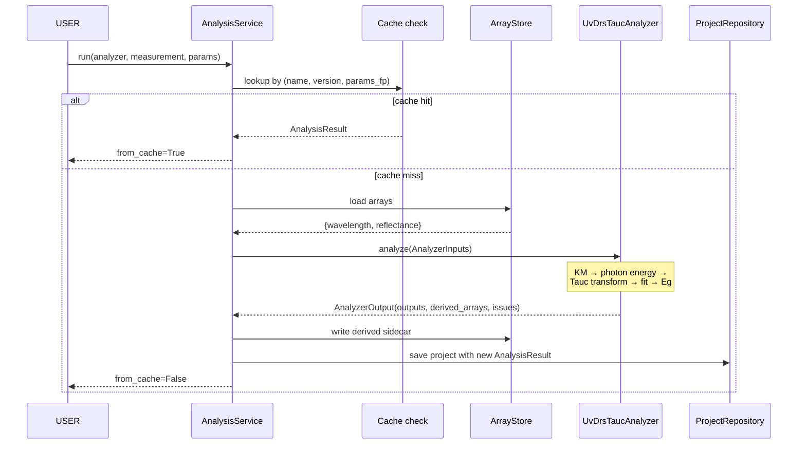

# Stage 3 — Derived analysis framework

**Status:** 🚧 in progress (3A + 3B complete; 3C UI + 3D second analyzer pending)
**Sub-stages covered so far:** 3A (`AnalysisResult` domain + persistence), 3B (analyzer protocol + UV-DRS Tauc)
**Date range:** 2026-05-13 – present

## 1. Goal

Turn parsed measurements into derived scientific quantities (band gap,
peak positions, transport figures of merit, ...) through a uniform
analyzer framework that mirrors the Stage 1 parser framework, with
results that persist alongside the parent measurement and re-appear on
project re-open.

## 2. Motivation

A `Measurement` carries raw arrays (wavelength + reflectance for
UV-DRS, 2θ + intensity for XRD, ...). The headline numbers a
researcher *actually wants* — band gap in eV, peak centers in 2θ,
zT at 300 K — require additional computation: a Tauc plot, a peak fit,
a Seebeck-σ-κ combination.

Without a dedicated analysis layer, every UI feature ("show me band
gap vs composition", "plot zT vs temperature for the X sample family")
would either re-compute on every open (slow), bake the analysis into
the parser (couples concerns), or scatter ad-hoc scripts across the
codebase (impossible to test or version).

Stage 3 establishes the analyzer-as-first-class-citizen pattern so
every future derived quantity follows the same machinery: a typed
input contract, a typed output contract, a registry, a service with
caching, and persistent storage of results.

## 3. Design decisions

- **Decision (3A):** `AnalysisResult` is an *immutable child* of
  `Measurement`, not a sibling.
  - Alternatives considered: Top-level `analysis_results` table
    referencing measurements; per-analyzer result tables.
  - Why this won: An analysis result without its parent measurement is
    meaningless. Cascade-delete handles cleanup; the existing
    repository's eager-load (`lazy="selectin"`) handles loading.
    `Measurement.analysis_results: tuple[AnalysisResult, ...]` mirrors
    `.files` and `.issues` exactly.

- **Decision (3A):** `params` and `outputs` are JSON columns.
  - Alternatives considered: Per-analyzer typed columns; per-analyzer
    subtables.
  - Why this won: Analyzer outputs are heterogeneous by definition
    (the Tauc analyzer produces `band_gap_ev` + `r_squared`; an XRD
    peak-fit analyzer produces `peak_centers_2theta` as a list +
    `fwhm_2theta` as a list). A typed-column schema would balloon as
    analyzers are added. JSON is the right shape; the producer
    guarantees JSON-safety.

- **Decision (3A):** Analyzer issues are inlined into a single
  `issues_json` column, not a separate `analysis_issues` table.
  - Alternatives considered: Sibling table mirroring
    `validation_issues`.
  - Why this won: Analyzer issues are typically 0–3 entries per
    result; the join cost dwarfs the data. Inlining keeps the read
    path simple.

- **Decision (3B):** `BaseAnalyzer.analyze()` never raises.
  - Alternatives considered: Exceptions for bad inputs.
  - Why this won: Same contract as `BaseParser.parse()`. A bad input
    (missing arrays, NaN data, fit non-convergence) surfaces as a
    `ValidationIssue` on the `AnalyzerOutput`. The UI shows the issue
    to the user; the cache key still records the attempt so repeated
    runs don't keep failing the same way.

- **Decision (3B):** Cache key includes `params_fingerprint`.
  - Alternatives considered: Cache on `(measurement_id,
    analyzer_name, analyzer_version)` only.
  - Why this won: An analyzer with different params (e.g. Tauc with
    `band_gap_type="direct"` vs `"indirect"`) is a *different
    analysis*, not a cache hit. Canonical JSON + SHA-256 → stable
    16-char hex fingerprint that's identical for semantically-equal
    dicts regardless of key order.

- **Decision (3B):** Re-running with same key *replaces* the prior
  result rather than appending.
  - Alternatives considered: Append every run; never delete.
  - Why this won: A measurement should not accumulate an unbounded
    list of `AnalysisResult`s with identical params just because the
    user clicked "Re-run" three times. The displaced result is gone;
    if the user wanted history, they'd have changed a parameter (and
    thus the fingerprint).

- **Decision (3B):** Derived arrays land in a sidecar Parquet file
  `<mid>.<analyzer_name>.<short_id>.parquet`, alongside the parsed
  arrays but with a compound filename.
  - Alternatives considered: One big Parquet per measurement with
    everything; per-analyzer subdirectory.
  - Why this won: Same `arrays/` directory keeps backup/sync rules
    simple. Compound filename makes provenance visible at the file-
    system level. Atomic `.tmp + os.replace` write reuses the
    `ArrayStore` pattern.

- **Decision (3B):** First analyzer is **UV-DRS Tauc**, not XRD
  peak-fit.
  - Alternatives considered: XRD peak-fit (more data in the
    dataset).
  - Why this won: Tauc is one well-defined computation with one
    headline scalar output (`band_gap_ev`). Peak-fit is a
    constrained-optimization problem with N variable-shape outputs.
    Tauc lets the protocol mature against a clean reference before
    being stressed by a harder case (XRD peak-fit becomes Stage 3D).

## 4. Methods / algorithms

### 4.1 Cache key (Stage 3B)

```math
\text{key} = (\text{measurement\_id},\ \text{analyzer\_name},\ \text{analyzer\_version},\ \text{fp}(\text{params}))
```

with

```math
\text{fp}(p) = \text{SHA-256}(\text{json.dumps}(p,\ \text{sort\_keys}=\text{True}))[:16]
```

Bumping the analyzer's version invalidates every cached entry that
analyzer ever produced — the same hash-and-version pattern Stage 1
uses for parsers.

### 4.2 Kubelka-Munk transform (Tauc, Stage 3B)

UV-DRS measures diffuse reflectance R ∈ [0, 1]. The Kubelka-Munk
function

```math
F(R) = \frac{(1 - R)^2}{2R}
```

is proportional to the absorption coefficient α of a thick, weakly-
absorbing scatterer (the standard powder/film geometry). [\[kubelka1931\]](../references.md#kubelka1931)

### 4.3 Photon energy conversion

```math
E\ [\text{eV}] = \frac{1240}{\lambda\ [\text{nm}]}
```

The constant is `hc/e` rounded to 4 significant figures (0.066% error,
the community standard).

### 4.4 Tauc plot

For a semiconductor with a band gap Eg, the absorption coefficient
above the gap obeys

```math
\alpha(E) \propto (E - E_g)^{1/n}
```

where n = 2 for a direct allowed transition and n = 1/2 for an
indirect allowed transition. The Tauc plot then plots

```math
y(E) = \big(F(R) \cdot E\big)^n
```

against E. The linear region of the rising edge, extrapolated to the
x-axis, gives Eg as the x-intercept. [\[tauc1966\]](../references.md#tauc1966) [\[davis1970\]](../references.md#davis1970)

### 4.5 Linear-fit window selection

Stage 3B's analyzer picks the fit window by *y-percentile* rather than
by hard-coded energy bounds: keep data points whose Tauc-y value lies
between `fit_window_y_min_frac × max(y)` and `fit_window_y_max_frac ×
max(y)`. Defaults are 0.20 and 0.60 — the rising-edge middle band.
This is robust to spectra with different absolute Tauc-y scales (band
gap energies of 1.7 eV vs 3.1 eV) without requiring per-sample tuning.

The linear fit itself is ordinary least squares (`np.polyfit(deg=1)`).
Goodness-of-fit is reported as R² on the fit window; the analyzer
emits a `Severity.WARNING` issue if R² < 0.95.

### 4.6 Output validation

`AnalysisService._validate_output()` enforces that an analyzer
returned:

- A dict for `outputs` (will round-trip through a JSON column)
- 1-D ndarrays of equal length for `derived_arrays` (same contract as
  `ParsedData.arrays`)
- A tuple of `ValidationIssue` for `issues`

A buggy analyzer returning the wrong shape raises `AnalysisError` at
the service layer (an actual exception, not a soft issue) — bugs in
analyzer code should fail loudly.

## 5. Implementation summary

| File | What it owns |
|---|---|
| `src/latos/core/models.py` | `AnalysisResult` dataclass + `Measurement.analysis_results` field |
| `src/latos/persistence/schema.py` | `AnalysisResultRow` ORM table + `LATEST_SCHEMA_VERSION=3` |
| `src/latos/persistence/mappers.py` | `analysis_result_to_row` / `row_to_analysis_result` + `ValidationIssue ↔ JSON` helpers |
| `src/latos/persistence/repository.py` | Save / load extended with `analysis_results` |
| `migrations/versions/0003_add_analysis_results.py` | Alembic migration for the new table |
| `src/latos/analysis/base_analyzer.py` | `BaseAnalyzer` ABC, `AnalyzerInputs`, `AnalyzerOutput` |
| `src/latos/analysis/registry.py` | `AnalyzerRegistry.find_for(measurement)` |
| `src/latos/analysis/service.py` | `AnalysisService.run(...)` — cache, persist, write derived Parquet |
| `src/latos/analysis/uv_drs/tauc.py` | `UvDrsTaucAnalyzer` — Kubelka-Munk + Tauc-plot band gap |

Key invariants enforced:

- Same shape, same value, same version → cache hit; otherwise compute.
- An analyzer that returns a non-conformant shape raises `AnalysisError`
  *at the service layer* (the analyzer protocol contract is hard-
  enforced, the analysis-content contract uses soft issues).
- `AnalysisResult.computed_at` is timezone-aware (same invariant as
  every other Latos timestamp).
- One `AnalysisResult` per `(analyzer_name, params_fingerprint)` per
  measurement — re-runs replace rather than accumulate.

## 6. Validation

- **Tests so far:** 793 total (61 new for Stage 3B alone; 22 for 3A
  domain + mappers + repository + migration).
- **Coverage:** 100% on `core/models` AnalysisResult, 100% on
  `persistence/mappers` for the new conversions, ≥90% on
  `analysis/service`, 100% on the Tauc analyzer's primary path.
- **Numerical accuracy (synthetic Tauc spectra):**
  - Direct gap recovered to within **50 meV** across {1.7, 2.05, 2.5,
    3.1} eV
  - Indirect gap recovered to within **100 meV** across {1.1, 1.5,
    2.0} eV
  - R² > 0.99 on synthetic data (clean reference)
- **Quality gates:** ruff + mypy strict clean.



## 7. Limitations

- **No UI yet (deferred to 3C).** Analyzers can be run from a Python
  script or test but the desktop app doesn't surface them yet. Stage
  3C adds an Analysis page + "Run analysis" buttons.

- **Single analyzer covers one technique.** The protocol generality
  is asserted by class shape but not yet validated against a second
  technique. Stage 3D (XRD peak-fit or transport zT) is the proof.

- **Fit window selection is heuristic.** The y-percentile window
  works for clean spectra; messy data may need a manual energy-range
  override. The UI in Stage 3C will surface a drag-to-select fit
  window control.

- **No multi-measurement analyzers yet.** Each `analyze()` call
  receives exactly one `Measurement`. A future cross-modal analyzer
  (e.g. "compare XRD peak shifts vs UV-DRS band gap across samples")
  needs an extended `AnalyzerInputs`. The current shape is
  forward-compatible — adding a `companion_measurements` field is
  non-breaking.

- **No batch run UI.** Running Tauc across all UV-DRS measurements in
  a project requires a loop in code. Stage 3C's UI surface includes a
  "Run on all" button per analyzer.

## 8. Thesis mapping

| Thesis section | What this stage feeds |
|---|---|
| 5.1 Motivation: from raw arrays to derived numbers | Motivation, the "raw arrays vs. headline numbers" gap |
| 5.2 Analyzer protocol | `BaseAnalyzer` ABC + Inputs/Output dataclasses; mirror to parser framework |
| 5.3 Persistence of derived results | `AnalysisResult` schema, JSON columns rationale, sidecar Parquet |
| 5.4 Caching strategy | `(measurement, analyzer, version, params)` key; the unified hash-and-version philosophy |
| 5.5 Reference analyzer: UV-DRS Tauc | Methods section 4.2–4.5; synthetic validation (50 meV tolerance) |
| 5.6 Future analyzers | Limitations section as the explicit roadmap (XRD peak-fit, transport zT) |

## See also

- [`RESULTS_LOG.md`](../../RESULTS_LOG.md) — chronological detail for 3A and 3B (entries are mostly captured via the commit messages on `de8ebc1` and `df83422`; a formal log entry can be appended)
- [`BENCHMARKS.json`](../../BENCHMARKS.json) — Stage 3 entry to be appended on closure
- [`figures/architecture.md`](../figures/architecture.md) — analysis sequence + cache-key strategy diagrams
- [`references.md`](../references.md) — `tauc1966`, `davis1970`, `kubelka1931`, `cullity2001` (XRD background)
